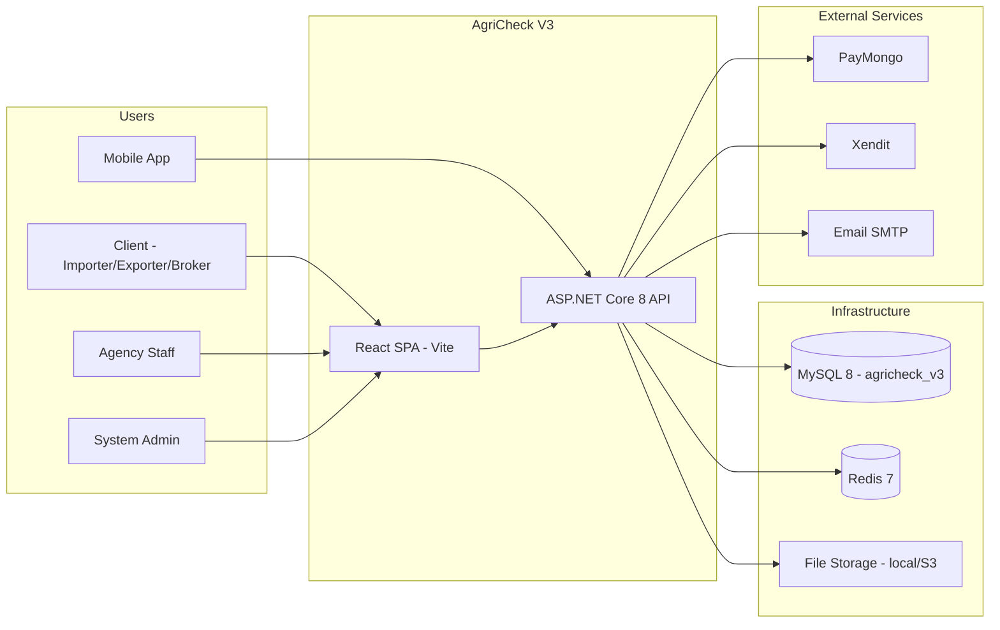
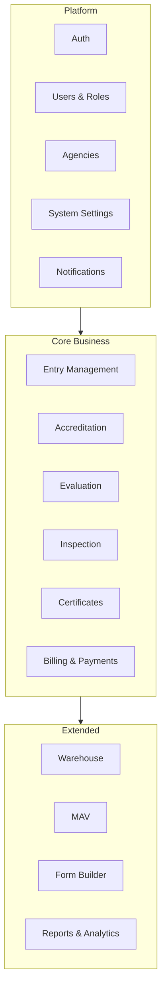

# AgriCheck V3 — Architecture

## 1. System Context



---

## 2. Backend Layering

```
backend/
├── src/
│   ├── AgriCheck.Api/              # Controllers, middleware, Program.cs
│   ├── AgriCheck.Application/      # Use cases, DTOs, validators, interfaces
│   ├── AgriCheck.Domain/           # Entities, enums, domain events
│   └── AgriCheck.Infrastructure/   # EF Core, Redis, email, file storage, payments
└── tests/
    ├── AgriCheck.UnitTests/
    └── AgriCheck.IntegrationTests/
```

### Responsibilities

| Layer | Contains | Must NOT contain |
|-------|----------|------------------|
| **Domain** | Entities, value objects, domain rules | EF attributes, HTTP, DTOs |
| **Application** | Commands/queries, services, DTOs, validation | DbContext, controllers |
| **Infrastructure** | EF mappings, repos, Redis, external SDKs | Business rules |
| **Api** | Controllers, auth, Swagger, filters | Direct DbContext usage |

### Pattern

- **CQRS-lite:** MediatR optional; start with application services + thin controllers
- **Repository pattern:** `IRepository<T>` for complex aggregates; direct `DbContext` for simple CRUD in early phases
- **Unit of Work:** `IUnitOfWork` wrapping `SaveChangesAsync`

---

## 3. Frontend Structure

```
frontend/
├── src/
│   ├── app/                 # store, router, providers
│   ├── features/            # domain modules (entry, accreditation, ...)
│   │   ├── auth/
│   │   ├── entries/
│   │   ├── accreditation/
│   │   └── ...
│   ├── shared/              # components, hooks, utils, types
│   ├── layouts/             # ClientLayout, AgencyLayout, AdminLayout
│   └── theme/               # MUI theme (forest/stone)
├── public/
└── vite.config.ts
```

### State Strategy

| State type | Tool |
|------------|------|
| Server data (API) | RTK Query |
| Auth session | Redux slice + localStorage refresh token |
| UI (modals, tabs) | React local state |
| Form wizards | React Hook Form + Zod |

---

## 4. API Conventions

### Base URL

```
/api/v1/{module}/{resource}
```

Examples:
- `POST /api/v1/auth/login`
- `GET /api/v1/entries`
- `GET /api/v1/entries/{id}`
- `POST /api/v1/warehouse/bookings`

### Response Envelope

```json
{
  "success": true,
  "data": { },
  "errors": null,
  "meta": {
    "page": 1,
    "pageSize": 20,
    "totalCount": 100
  }
}
```

### Error Envelope

```json
{
  "success": false,
  "data": null,
  "errors": [
    { "code": "ENTRY_NOT_FOUND", "message": "Entry not found." }
  ]
}
```

### Auth Header

```
Authorization: Bearer {accessToken}
```

Refresh via `POST /api/v1/auth/refresh` with `{ "refreshToken": "..." }`.

---

## 5. Security Model

### Role Hierarchy (from V2)

```
ROLE_ADMIN
  └── ROLE_EVALUATOR, ROLE_BILLING_AGENT, ROLE_ACCREDITATION_OFFICER
      └── ROLE_MAV_ADMIN
          └── ROLE_MAV_SECRETARY
ROLE_MAV_EVALUATOR, ROLE_MAV_SECRETARY → ROLE_USER
ROLE_EVALUATOR, ROLE_BILLING_AGENT, ROLE_ACCREDITATION_OFFICER → ROLE_USER
ROLE_INSPECTOR → ROLE_USER
ROLE_DOCTOR → ROLE_INSPECTOR → ROLE_USER
ROLE_OPERATOR, ROLE_DRIVER, ROLE_WAREHOUSE_STAFF → ROLE_USER
ROLE_IMPORTER, ROLE_EXPORTER, ROLE_BROKER → ROLE_USER
```

### Authorization

- ASP.NET **Policy-based** authorization
- Policies map to roles + agency scope (user belongs to agency X → only agency X data)
- Public routes: login, register, certificate verify, health

### JWT

| Token | Lifetime | Storage |
|-------|----------|---------|
| Access | 15 min | Memory / Redux |
| Refresh | 7 days | HttpOnly cookie OR secure storage (mobile) |

Revoked refresh tokens stored in Redis.

---

## 6. Module Boundaries



Each module owns:
- Domain entities
- Application services
- API controllers under `/api/v1/{module}`
- Frontend feature folder

---

## 7. File Storage

| File type | Path pattern | Notes |
|-----------|--------------|-------|
| Entry documents | `/storage/entries/{entryId}/{fileId}` | Virus scan hook (future) |
| Inspection photos | `/storage/inspections/{inspectionId}/` | Thumbnails generated |
| Certificates PDF | `/storage/certificates/{certId}.pdf` | Immutable after issue |
| Accreditation files | `/storage/accreditation/{submissionId}/` | Versioned |

Dev: local `wwwroot/storage` or `./storage`  
Prod: Azure Blob / S3-compatible (abstract via `IFileStorage`).

---

## 8. Caching (Redis)

| Key pattern | TTL | Use |
|-------------|-----|-----|
| `auth:revoked:{jti}` | 7d | Revoked refresh tokens |
| `ratelimit:{ip}:{endpoint}` | 1m | Login throttling |
| `cache:commodities` | 1h | Lookup tables |
| `cache:settings` | 5m | System settings |

---

## 9. Integrations

| Service | V2 | V3 approach |
|---------|-----|-------------|
| PayMongo | PHP SDK | .NET HTTP client or community SDK |
| Xendit | PHP SDK | Official Xendit .NET SDK |
| QR | endroid/qr-code | QRCoder |
| PDF | dompdf/TCPDF | QuestPDF or iText7 (license check) |
| Excel export | PHPSpreadsheet | ClosedXML or EPPlus |
| Email | Symfony Mailer | MailKit |

Webhooks: dedicated controllers with signature verification + idempotency keys.

---

## 10. Deployment Topology (Future)

```
[Browser] → [Nginx / IIS]
              ├── /        → React static (frontend/dist)
              └── /api     → ASP.NET Core (Kestrel)
                    ├── MySQL (agricheck_v3)
                    └── Redis
```

Local dev:
- Frontend: Vite proxy `/api` → `http://localhost:5000`
- Backend: Kestrel on port 5000
- MySQL: XAMPP on 3306
- Redis: local install or Docker

---

## 11. Observability

- **Serilog** → file + console (dev), structured JSON (prod)
- **Health checks:** `/health`, `/health/db`, `/health/redis`
- **Correlation ID** middleware on every request
- **Audit log** table for sensitive actions (payments, cert issue, role change)

---

## 12. Testing Strategy

| Level | Tool | Scope |
|-------|------|-------|
| Unit | xUnit + Moq | Domain rules, validators |
| Integration | WebApplicationFactory | API + in-memory or test MySQL |
| E2E | Playwright | Critical user journeys per phase |
| Contract | Swagger diff | Breaking API changes |

---

## 13. UI Design Direction

Carry forward V2 client portal **forest/stone** theme into MUI:

| Token | Value (approx.) |
|-------|-----------------|
| Primary | `#2d5016` (forest green) |
| Secondary | `#8b7355` (stone) |
| Background | `#f5f3ef` |
| Surface | `#ffffff` |
| Font | Inter or system sans |

Layouts:
- `ClientLayout` — sidebar + top bar (entries, accreditation, certificates, warehouse)
- `AgencyLayout` — agency-branded header
- `AdminLayout` — dense data tables
- `InspectorLayout` — mobile-friendly inspection flows

Reference V2 templates in `../agricheck/templates/client/` and `public/css/agricheck-global.css`.
