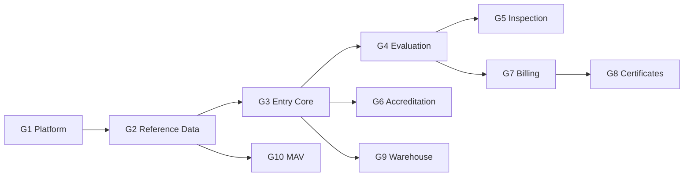
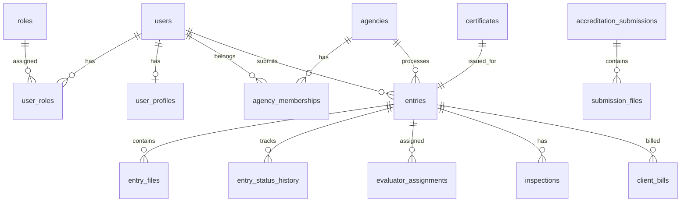

# AgriCheck V3 — Database Design (Fresh)

## 1. Overview

AgriCheck V3 uses a **brand-new MySQL 8 database**. No tables are copied from V2. Schema is built incrementally via **EF Core code-first migrations**, one domain group at a time.

| Setting | Value |
|---------|-------|
| Database name | `agricheck_v3` |
| Charset | `utf8mb4` |
| Collation | `utf8mb4_unicode_ci` |
| Engine | InnoDB |
| Naming | snake_case table/column names (EF convention) |

---

## 2. Design Principles

1. **Normalize first** — avoid V2 denormalization debt where it caused bugs
2. **Soft deletes** — `deleted_at` on user-facing records where audit requires it
3. **Timestamps** — `created_at`, `updated_at` on all tables; `created_by` where relevant
4. **UUIDs vs ints** — `BIGINT` PKs internally; public `uuid` CHAR(36) for external IDs (entries, certificates)
5. **Agency scoping** — foreign key to `agencies` on all agency-owned records
6. **Status enums** — stored as VARCHAR or TINYINT mapped to C# enums; document in Domain layer

---

## 3. Domain Groups & Build Order



---

## 4. G1 — Platform (Phase P1)

| Table | Purpose |
|-------|---------|
| `users` | Login account (email, password hash, status, email_verified_at) |
| `user_profiles` | Name, phone, company, address |
| `roles` | Role catalog (code, name, description) |
| `user_roles` | Many-to-many user ↔ role |
| `agencies` | BAI, BFAR, BPI, etc. (code, name, logo, settings JSON) |
| `agency_memberships` | User assigned to agency with role override |
| `refresh_tokens` | Token hash, user_id, expires_at, revoked_at |
| `password_reset_tokens` | Email reset flow |
| `audit_logs` | actor_id, action, entity_type, entity_id, payload JSON |
| `system_settings` | Key-value config |

**Seed data (dev):**
- Roles: all V2 roles
- Agencies: BAI, BFAR, BPI (minimum)
- Admin user: `admin@agricheck.local`

---

## 5. G2 — Reference Data (Phase P2 start)

| Table | Purpose |
|-------|---------|
| `commodity_categories` | Category tree |
| `commodities` | Commodity list per category |
| `document_types` | Required doc types per workflow |
| `fee_schedules` | Processing fees |
| `payment_method_configs` | PayMongo/Xendit settings (encrypted secrets) |
| `terms_of_agreement` | Versioned T&C |
| `canned_responses` | Evaluator quick replies |

---

## 6. G3 — Entry Core (Phase P2)

| Table | Purpose |
|-------|---------|
| `entries` | Main entry record (uuid, reference_no, status, applicant_id, agency_id) |
| `entry_details` | Commodity, quantity, origin, destination, etc. |
| `entry_containers` | Container lines linked to entry |
| `entry_files` | Uploaded documents |
| `entry_file_versions` | Version history |
| `entry_status_history` | Status transition log |
| `entry_history` | User-visible timeline events |
| `entry_agency_assignments` | Which agencies evaluate which entry |
| `entry_submissions` | Submission batches / resubmissions |
| `timeline_events` | Unified timeline feed |

**Key statuses:** `draft`, `submitted`, `under_review`, `approved`, `rejected`, `cancelled`

---

## 7. G4 — Evaluation (Phase P3)

| Table | Purpose |
|-------|---------|
| `evaluator_assignments` | Evaluator ↔ entry |
| `file_evaluations` | Per-file approve/reject/revise |
| `submission_file_evaluations` | Accreditation file evals |
| `evaluator_notes` | Internal notes |
| `compliance_checklists` | Checklist templates |
| `compliance_checklist_items` | Items per checklist |
| `entry_compliance_deadlines` | Deadline tracking |
| `evaluation_timeline` | Evaluation-specific events |

---

## 8. G5 — Inspection (Phase P3)

| Table | Purpose |
|-------|---------|
| `inspections` | Inspection record |
| `inspection_photos` | Photo metadata |
| `inspection_photo_evaluations` | Photo review |
| `inspection_files` | Attached forms |
| `inspection_form_data` | Dynamic form JSON |
| `container_inspection_forms` | Container-level forms |
| `containers` | Physical container tracking |
| `container_locations` | Location history |

---

## 9. G6 — Accreditation (Phase P2)

| Table | Purpose |
|-------|---------|
| `accreditations` | Company accreditation record |
| `accreditation_submissions` | Submission workflow |
| `accreditation_history` | Status history |
| `submission_files` | Uploaded accreditation docs |
| `submission_file_reviews` | Review per file |

---

## 10. G7 — Billing & Payments (Phase P2–P3)

| Table | Purpose |
|-------|---------|
| `billings` | Agency billing records |
| `client_bills` | Bills to clients |
| `client_bill_payments` | Payment records |
| `processing_fee_configs` | Fee rules |
| `processing_fee_payments` | Fee payment tracking |
| `payment_audit_logs` | Payment audit trail |
| `payment_link_access_logs` | Pay link access |
| `payments` | Generic payment table |
| `payment_proofs` | Manual proof uploads |

---

## 11. G8 — Certificates (Phase P4)

| Table | Purpose |
|-------|---------|
| `certificates` | Issued certificate |
| `certificate_templates` | Template definition |
| `certificate_template_versions` | Version history |
| `certificate_elements` | Builder elements (text, QR, image) |
| `certificate_process_assignments` | Workflow assignment |

Public verification uses `certificates.verification_code` (unique, indexed).

---

## 12. G9 — Warehouse (Phase P2 ops, P6 full)

| Table | Purpose |
|-------|---------|
| `warehouse_facilities` | Facility master |
| `warehouse_bookings` | Client bookings |
| `warehouse_booking_billing` | Booking charges |
| `warehouse_inventory` | Stock levels |
| `release_authorizations` | Release approval |
| `release_records` | Release events |

---

## 13. G10 — MAV (Phase P5)

| Table | Purpose |
|-------|---------|
| `mav_application_periods` | Application windows |
| `mav_applications` | Importer applications |
| `mav_licenses` | Issued licenses |
| `mav_accounts` | Financial accounts |
| `mav_account_transactions` | Ledger |
| `mav_commodity_allocations` | Commodity MIC allocation |
| `mav_import_certificates` | Import certs |
| `mav_audit_logs` | MAV-specific audit |
| `mic_utilizations` | MIC usage tracking |
| `mav_notification_preferences` | User prefs |

---

## 14. G11 — Forms & Notifications (Phase P4)

| Table | Purpose |
|-------|---------|
| `form_templates` | Dynamic form definitions |
| `form_template_versions` | Versioned JSON schema |
| `form_fields` | Field definitions |
| `form_agency_tags` | Agency ↔ form mapping |
| `form_accreditation_types` | Accreditation type mapping |
| `form_analytics` | Usage stats |
| `notifications` | In-app notifications |
| `notification_preferences` | User notification settings |

---

## 15. G12 — Driver / Mobile (Phase P6)

| Table | Purpose |
|-------|---------|
| `driver_profiles` | Driver info |
| `driver_documents` | License, OR/CR |
| `driver_profile_history` | Change log |
| `face_verification_logs` | Face verify attempts (if scoped in) |
| `offline_sync_queue` | Mobile offline sync |

---

## 16. Migration Workflow

```powershell
# From backend/ (after scaffold)
dotnet ef migrations add InitialPlatform -p src/AgriCheck.Infrastructure -s src/AgriCheck.Api
dotnet ef database update -p src/AgriCheck.Infrastructure -s src/AgriCheck.Api
```

Each domain group = one or more migrations:
- `20250909_InitialPlatform`
- `20250920_ReferenceData`
- `20251001_EntryCore`
- ...

---

## 17. Local MySQL Setup (XAMPP)

```sql
CREATE DATABASE agricheck_v3
  CHARACTER SET utf8mb4
  COLLATE utf8mb4_unicode_ci;

CREATE USER 'agricheck_v3'@'localhost' IDENTIFIED BY 'change_me_in_env';
GRANT ALL PRIVILEGES ON agricheck_v3.* TO 'agricheck_v3'@'localhost';
FLUSH PRIVILEGES;
```

Connection string (appsettings.Development.json — not committed):

```
Server=localhost;Port=3306;Database=agricheck_v3;User=agricheck_v3;Password=***;
```

---

## 18. V2 → V3 Data (Optional, Phase P7 Only)

Fresh DB for development. For production cutover, optional ETL:

| V2 source | V3 target | Notes |
|-----------|-----------|-------|
| `user` | `users` + `user_profiles` | Re-hash not possible — force password reset |
| `entry` | `entries` | Map status enum carefully |
| `certificate` | `certificates` | Regenerate PDFs optional |

ETL lives in separate `tools/v2-import/` — out of scope until P7.

---

## 19. Indexing Guidelines

- Unique: `users.email`, `entries.uuid`, `entries.reference_no`, `certificates.verification_code`
- Composite: `(agency_id, status)` on entries, `(user_id, revoked_at)` on refresh_tokens
- Full-text: defer until search requirements defined

---

## 20. ER Diagram (High Level)



Full per-module ER diagrams to be added under `database/diagrams/` as each group is implemented.
